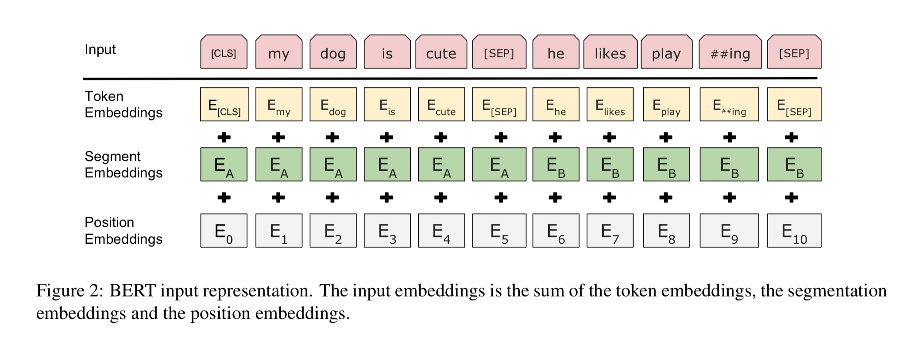
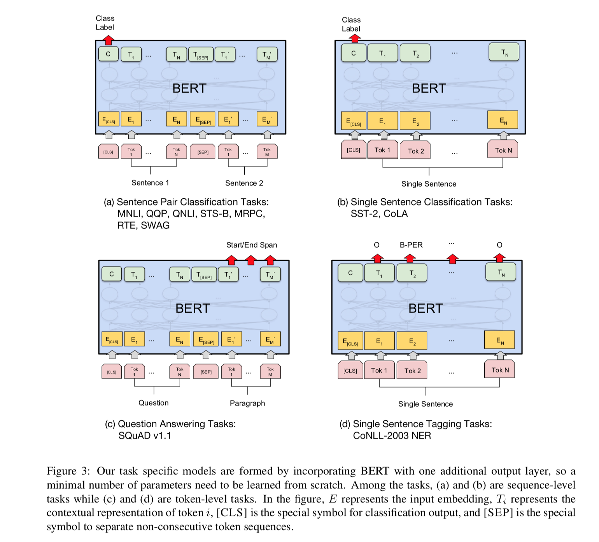
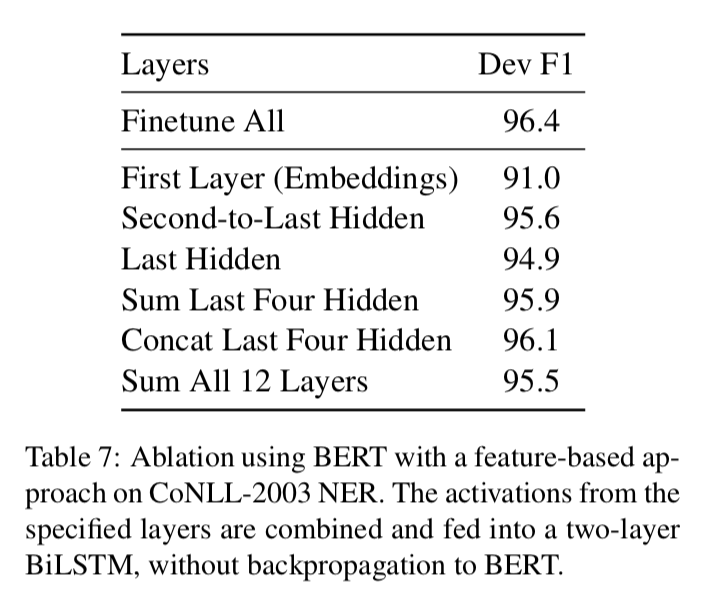

- Ссылка на статью: [[arXiv](https://arxiv.org/pdf/1810.04805.pdf)]

1. 
	Обучаем языковую модель (Task #1: Masked LM + Task #2: Next Sentence Prediction).
	Архитектура:
	- BERTBASE: L=12, H=768, A=12, Total Parameters=110M
	- BERTLARGE: L=24, H=1024, A=16, Total Parameters=340M (да, там правда 24 слоя)

	1.
		Интересная токенизация 
		Используется WordPiece: https://github.com/google/sentencepiece

		На вход подаем по 2 последовательности, разделенных спец символом [SEP].
		Например для SQuAD это будет question и text.

	2.  
		Task #1: Masked LM.
		Языковая модель называется **Masked Language Model**. Обычно в языковой
		модели предсказывается следующее слово в последовательности. Здесь
		же предлагается маскировать случайное слово в последовательности и уже
		его предсказывать. Это позволяет использовать двунаправленные модели.
		Причем маскирование тоже по хитрому происходит:

		```

		• Rather than always replacing the chosen words with [MASK], the data generator will do the following:
		• 80% of the time: Replace the word with the [MASK] token, e.g., my dog is hairy → my dog is [MASK]
		• 10% of the time: Replace the word with a randomword,e.g.,my dog is hairy → my dog is apple
		• 10% of the time: Keep the word un- changed, e.g., my dog is hairy → my dog is hairy. The purpose of this is to bias the representation towards the actual observed word.
		```

	3. 
		Task #2: Next Sentence Prediction
		Кроме Masked Language Model сеть также обучается предсказывать следующее предложение на основе предыдущего. Вместо декодера, просто предсказывается метка IsNext или IsNotNext:

		```
		Input = [CLS] the man went to [MASK] store [SEP] he bought a gallon [MASK] milk [SEP]
		Label = IsNext
		Input = [CLS] the man [MASK] to the store [SEP] penguin [MASK] are flight ##less birds [SEP]
		Label = NotNext
		```

	4. 
		Для обучения использовались корпуса Википедии (2,500M words) и BookCorpus (800M words).

		```
		Training of BERTBASE was performed on 4 Cloud TPUs in Pod configuration (16 TPU chips total).5 Training of BERTLARGE was performed on 16 Cloud TPUs (64 TPU chips total). Each pre- training took 4 days to complete.
		```

2. 
	Делаем fine-tuning обученной модели на целевой задаче. 
	Берем обученную сеть до последнего скрытого слоя, добавляем еще один слой (метки целевой задачи). Обучаем эту сеть несколько эпох на данных целевой задачи. PROFIT.

	

	В итоге на всех задачах получаем SOTA.

3. 
	Также можно просто использовать эмбеддинги полученные предобученной сеткой без fine-tuning. Правда качество уже не такое впечатляющее, но это во много зависит
	от того как их использовать (см. таблице ниже). Можно скрытое состояние первого
	слоя, а можно сумму всех слоев. В последнем случае получается почти также хорошо как
	и в finetune сценарии.

	


