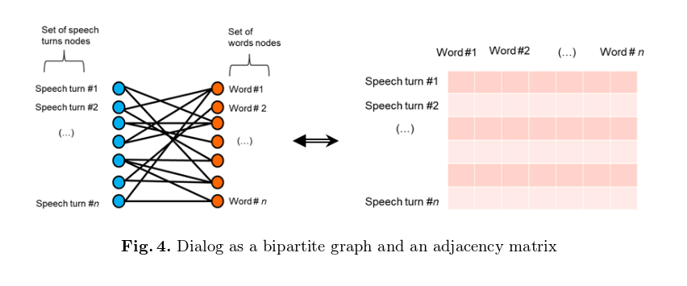
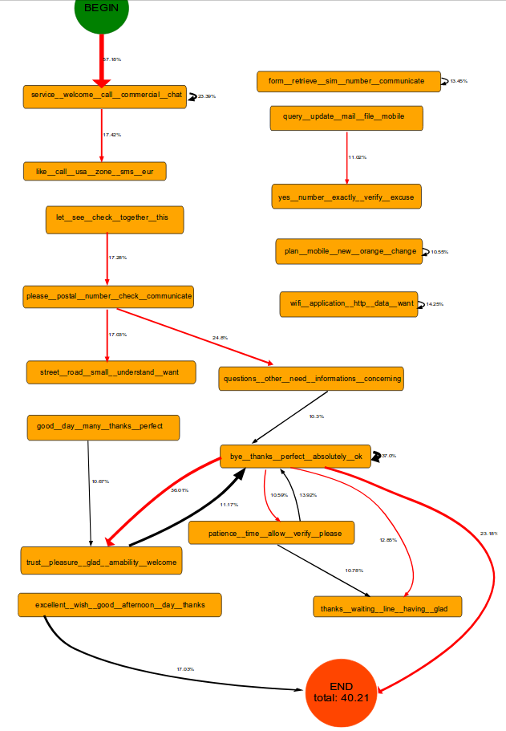
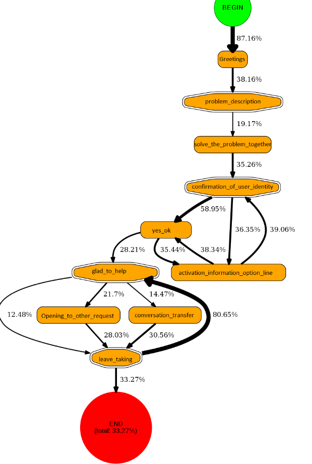

- Cluster-Based Graphs for Conceiving Dialog Systems [[Paper](http://ceur-ws.org/Vol-1880/paper2.pdf)]

В это статье предлагается способ получения конечного автомата диалога из диалогового корпуса с использованием бикластеризации.

- Вход: диалоговый корпус.
- Выход: общий граф диалога (конечный автомат).

Польза заключается в том, что можно получить примерную архитектуру диалогового агента из корпуса.
Затем на ее основе уже можно делать финальное решение.

## Общий алгоритм

1. Диалоговый корпус представляем в виде матрицы смежности двудольного графа.
Первая доля - номер шага в диалоге (speech turn).
Вторая доля - словарь.

2. Применяем алгоритм бикластеризации на матрице смежности (speech turn x words).

Если обычная кластеризация работает либо по строкам, либо по столбцам матрицы, то
бикластеризация использует одновременно строки и столбцы.
Получается, что как номер шага, так и частотность слов будет использована при кластеризации.

Подробнее про бикластеризацию:

- Понятная презентация http://cs-people.bu.edu/evimaria/cs565-13/co-clustering.pdf
- Вики: https://ru.wikipedia.org/wiki/%D0%91%D0%B8%D0%BA%D0%BB%D0%B0%D1%81%D1%82%D0%B5%D1%80%D0%B8%D0%B7%D0%B0%D1%86%D0%B8%D1%8F

В бикластеризации число кластеров определяется автоматически.

3. После бикластеризации, каждому speech turn был поставлен в соответствие кластер, например:

- speech turn 1 - cluster 1
- speech turn 2 - cluster 1
- speech turn 3 - cluster 4
- ...

Надо иметь в виду, что каждому кластеру также соответствуют слова из словаря, поэтому можно
не читая диалоги получить примерное название кластера.

4. Далее в исходном корпусе каждый speech turn заменялся на соответствующий кластер.
В итоге диалог будет выглядеть примерно так:

- User: Cluster 1
- Bot: Cluster 1
- User: Cluster 2
- Bot: Cluster 3

Последовательность также сохраняется, поэтому по корпусу можно построить общий граф диалога (конечный автомат).
Для этого нужно сделать матрицу смежности Cluster x Cluster, где ячейка c_ij это число ответов, такое что
предыдущим был cluster i, а текущий cluster j.

По получившейся матрице смежности уже можно построить граф диалога.

Пример получившегося сырого графа диалога:

Пример вручную доработанного графа диалога (переименованы и смерджены некоторые кластеры):

