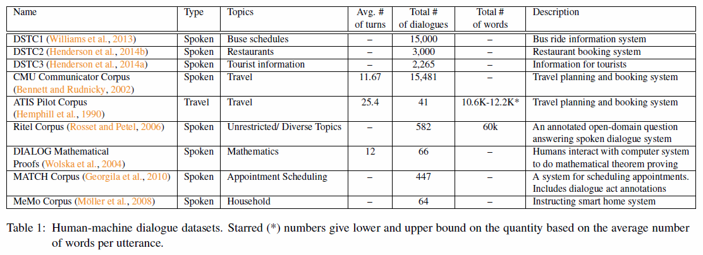
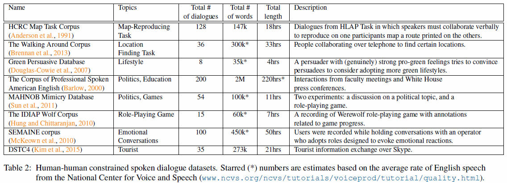
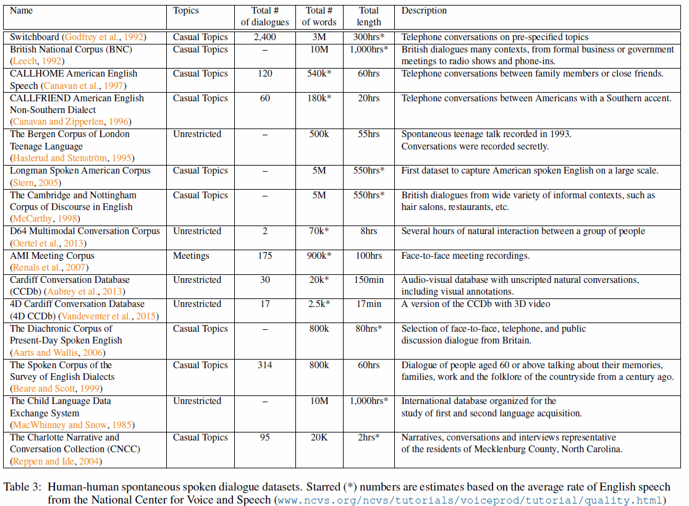
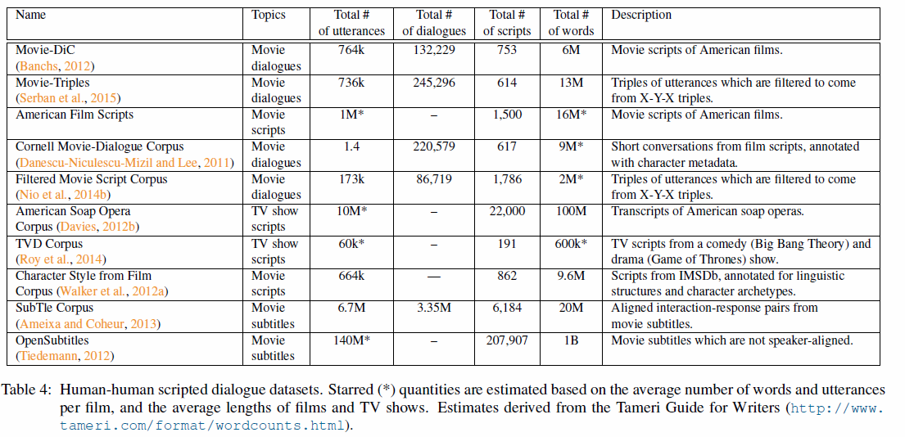
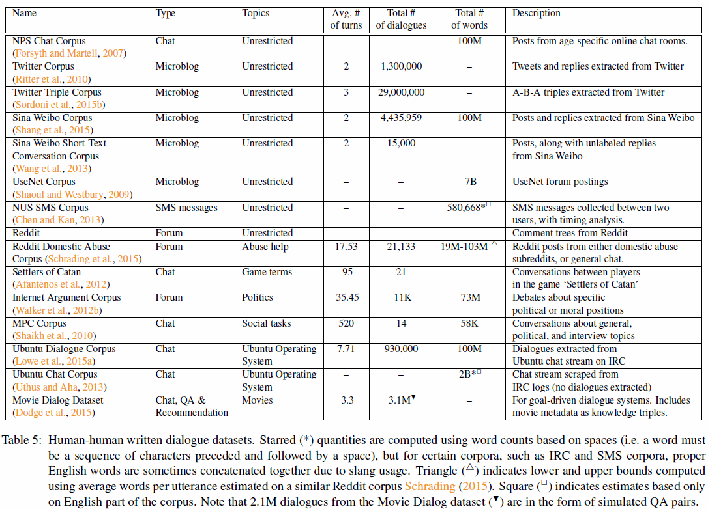

#A Survey of Available Corpora for Building Data-Driven Dialogue Systems
[1512.05742](https://arxiv.org/abs/1512.05742) 

Обзор доступных корпусов + обзор corpus-based подходов для построения  диалоговых систем.

Помимо corpus-based: обучение через взаимодействие с человеком, симуляторы пользователя, RL. Эти подходы в статье не описываются.

Диалоговые системы: goal / non-goal, генеративные / ранжирование (выбор лучшего ответа из заготовленных) / rule-based

Корпуса могут быть: 
- человек-человек / человек-машина
- письменная / устная речь (устная менее формальная, больше местоимений, сильнее зависит от контекста)
- естественные / неестественные: идеальный случай - участники диалога не знают, что их разговоры потом будут использованы, участники диалога - репрезентативная выборка из целевой аудитории диалоговой системы.
Если участники диалогов - нанимаемые люди, то может возникать проблема с тем, что их цели и мотивации могут отличаться от целей будущих пользователей диалоговой системы.
Подход получивший название *Wizard of Oz* (пользователь думает, что общается с агентом, но на самом деле ему отвечает другой человек) позволяет получить диалоги наиболее близкие к естественным.
- вымышленные диалоги (фильмы, литература)

##Сводные таблицы по доступным корпусам

Корпуса с диалогами могут быть использованы наряду с вопросно-ответными (QA) и рекомендательными датасетами, так можно выделить несколько задач, с которыми должны справляться диалоговые системы:
- ответы на вопросы пользователя (QA)
- рекомендации
- ответы на вопросы с рекомендациями
- поддержание беседы (casual conversation)

## Обучение на корпусах

### 1. Предобработка
Обработка аномалий: акронимы, слэнг, опечатки, фонемизация (слова записаны как произносятся).
Что можно делать (обычные NLP приемы):
- стемминг, лемматизация
- перевод акронимов и слэнга в "обычный" язык (есть [cписки](http://www.ircbeginner.com/ircinfo/abbreviations.html) таких слов)
- исправление опечаток (не всегда хорошо, автор приводит пример применения спеллчекера к корпусу субтитров и получил увеличение числа опечаток, лучше использовать [списки](https://en.wikipedia.org/wiki/Commonly_misspelled_English_words) слов с "типичными" опечатками)
- удаление не слов (hmm, oh, ah)
- ничего не делать, если данных очень много

### 2. Сегментация

Разбиение на спикеров и определение границ диалогов.

Можно разметить небольшую часть корпуса (золотой стандарт) и обучить на ней сегментатор и им разметить остальной корпус.

Есть трудности сегментации чатов и каналов: несколько участников диалога одновременно.
Часто применяют разные эвристики и ручные правила:
- по времени между репликами
- отсеивание спикеров из диалога (пока на них напрямую не ссылаются) [Ubuntu Dialog Corpus 1506.08909](https://arxiv.org/abs/1506.08909)
- автоматические методы:
  - [Text-based speaker identification for multi-participant open-domain dialogue systems](http://blueanalysis.com/iulianserban/Files/SpeakerClassification.pdf)
  - [You Talking to Me? A Corpus and Algorithm for Conversation Disentanglement](http://www.aclweb.org/website/old_anthology/P/P08/P08-1.pdf)
  
### 3. Дискриминантные модели
- предсказание intent'a пользователя / определение диалогового акта
- темы высказывания
- извлечение какой-либо информации
- определение состояний диалога
- ...

### 4. Модели генерирующие ответ
- ранжирующие модели - выбор лучшего ответа из предоставленного списка
- генеративные модели - полностью генерирущие ответную реплику
