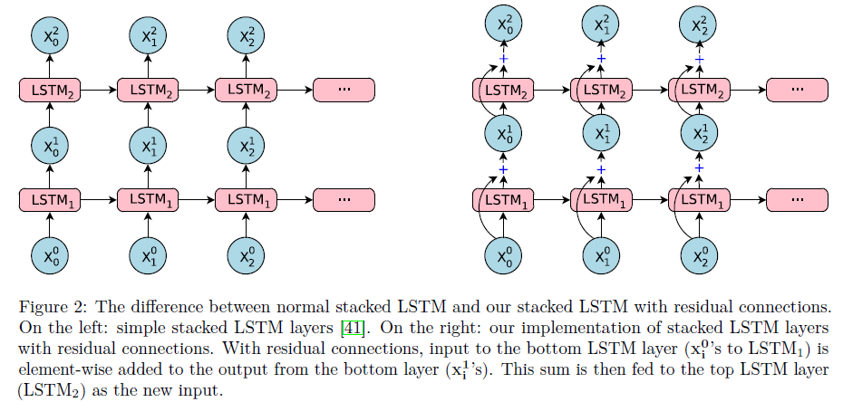
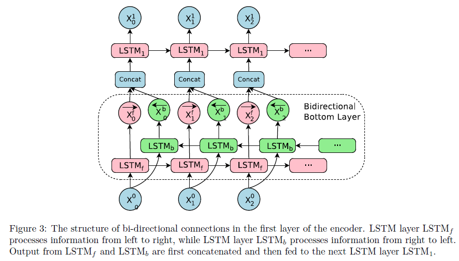
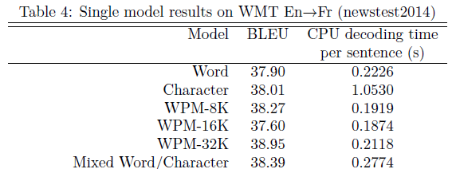
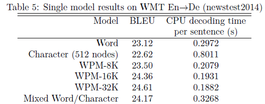
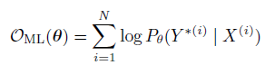
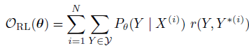
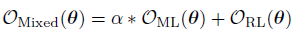
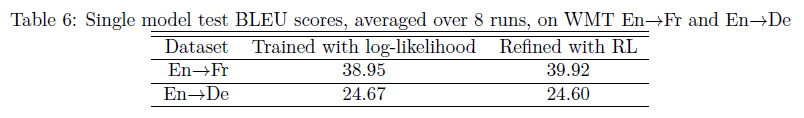
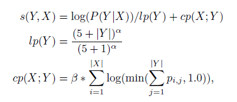

## Google's Neural Machine Translation System: Bridging the Gap between Human and Machine Translation
[1609.08144](https://arxiv.org/abs/1609.08144)

### Введение
В статье описывается создание end-to-end системы машинного перевода: decoder-encoder сеть с 8 LSTM слоями, residual связями и механизмом attention. Приведены результаты экспериментов с пословной моделью с фиксированным словарем, посимвольной, смешанной и со специальным токенизатором на [wordpieces](https://github.com/google/sentencepiece). Для увеличения скорости вычислений сеть была квантизирована (вычисления с меньшей разрядностью). Для решения проблемы того, что cross-entropy loss не оптимизирует на самом деле BLEU метрику был добавлен элемент обучения с подкреплением.

Преимуществом нейросетевого машинного перевода (NMT) над phrased-based статистическим машинным переводом (PBSMT) является, то что он выучивает из текстов сам, то как надо переводить и не зависит от инженерных решений в SMT, таких как, например, выравнивание текстов, построение фразовых таблиц. На практике же NMT системы обычно показывают результаты хуже SMT. Есть три момента, которые могут это объяснить: NMT медленнее обучаются и генерируют перевод, плохо работают с редкими словами, иногда переводят не все предложение, "забывая" перевести какие-нибудь слова.

Авторы статьи предлагают архитектуру GNMT как решение трех обозначенных проблем:
* редкие слова - wordpieces
* долго обучать - распараллеленные на 8 GPU вычисления (по слою на GPU)
* долго генерится ответ / долго обучать - квантизация сети
* долго генерится ответ - wordpieces в том смысле, что если большой размер словаря, то долго считать softmax, а если посимвольная, то долго генерить по одному символу
* "забывание" что-то перевести - лучевой поиск: coverage penalty (?) и нормализация длины (?)

### Архитектура модели

Глубокие рекуррентные сети показывают значительно лучшие результаты, чем неглубокие. Так, каждый LSTM слой уменьшает perplexity на 10%.
Но просто стакать LSTM слои можно только до какой-то определенной глубины: сеть становится труднее обучать все из-за тех же проблем с затухающим и взрывающимся градиентом. Просто стакнутые LSTM сети хорошо работают с числом слоев 4, с трудом для 6 и очень плохо на 8 слоях. Поэтому для глубоких сетей добавляются residual связи между LSTM слоями:

Первый слой енкодера является двунаправленным: результат енкода слева направо конкатенируется с результатом енкода справа налево.

### Параллелизм в модели и данных
* Данные:
  * Обучаются одновременно несколько реплик модели (10) используя [Downpour SGD](https://static.googleusercontent.com/media/research.google.com/ru//archive/large_deep_networks_nips2012.pdf). Все реплики имеют одинаковые параметры и асинхронно их обновляют (минибатчи по 128 пар предложений).
* Модель:
  * Каждый слой считается на своем GPU: i+1 слой может начать вычисления не дожидаясь конца вычисления i-ого.
  * В этом есть и свой минус - не получится эффективно использовать двунаправленные слои, т.к. необходимо дождаться завершения прохода с слева и справа. Если сделать все слои енкодера двунаправленными, то распараллелить вычисления можно только на 2 GPU.
  * Механизм attention связывает нижний слой енкодера и верхний слой декодера, а не верхний с верхним.

### Сегментация
* Fixed vocabulary
  * Проблемы со словами вне словаря (OOV):
  *  Например, просто копирование неизвестного слова (тк большинство неизвестных слов какие-либо названия или непереводимые)
* Character model
  * \+ небольшой словарь
  * \- последовательности сильно длинее -> сложнее и дольше обучать
* Mixed Word/Character
  * фискированный словарь
  * неизвестные слова - последовательность символов со спец. тегами (начало, середина, конец слова).
* Wordpiece model
  * разбиение предложения на токены - нграммы.
  * This is a house -> _Th is _is _a _hou se
  * задается размера словаря (8k/16k/32k/64k) и корпус, и токенизатор обучается
  * модель одна для source и target языка: модель сможет научиться копировать неизвестные слова
  * частотные слова становятся одним токеном, редкие - разбиваются на несколько
  * \+ фиксированный размер словаря
  * \+ нет проблемы с неизвестными словами
  * \+ хорошо для языков с богатой морфологией

### Результаты

### Обучение / loss
Стандартный cross-entropy loss слабо связан с целевой метрикой BLEU.

Поэтому предлгают следующее усовершенстование c 

, где r(Y, Y\*) - скор для одного предложения и усреднение по всем выдываемым предложениям Y, до определенной длины.

И итоговый лосс - линейная комбинация с весом alpha=0.017(!):

Стоит отметить, что авторы работали не с BLEU, а с его модификацие GLEU (Google?), которая хорошо коррелирует на уровне корпусов c BLEU и лучше работает для отдельных предложений. GLEU = min(precision, recall) над всеми 1,2,3,4-граммами. Сначала обучали модель с максимумом правдоподобия пока не сойдется и затем с mixed-loss пока BLEU не перестал увеличиваться.

### Квантизация и TPU
Показали, что на своих TPU быстрее происходит decoding и заточили модель под TPU производя вычисление с 8/16 битными целыми числами. График loss'а стал более гладким и loss стал чуть меньше, чем у обычной модель.

### Декодинг
Для выбора лучшей гипотезы из генерируемых моделью используется лучевой поиск (выбор гипотезы максимизирующей score). Авторы предлагают два усовершенствования: [coverage penalty](https://arxiv.org/abs/1601.04811v2) и lentgh normalization.
* length normalization
  * цель учесть тот факт, что необходимо сравнивать гипотезы разной длины
  * без учета этого, лучевой поиск будет предпочитать короткие переводы, тк с увеличением длины гипотезы ее вероятность может только уменьшаться
  * итого: делить на length^alpha, alpha  принадлежит [0, 1] и является параметром для оптимизации (подобрали 0.6-0.7)
* 

В лучевом поиске поддерживалось 8-12 гипотез, но использование меньшего числа (2-4) только незначительно сказалось на ухудшении BLEU.
Ну и еще свои модификации в лучевой поиск.
