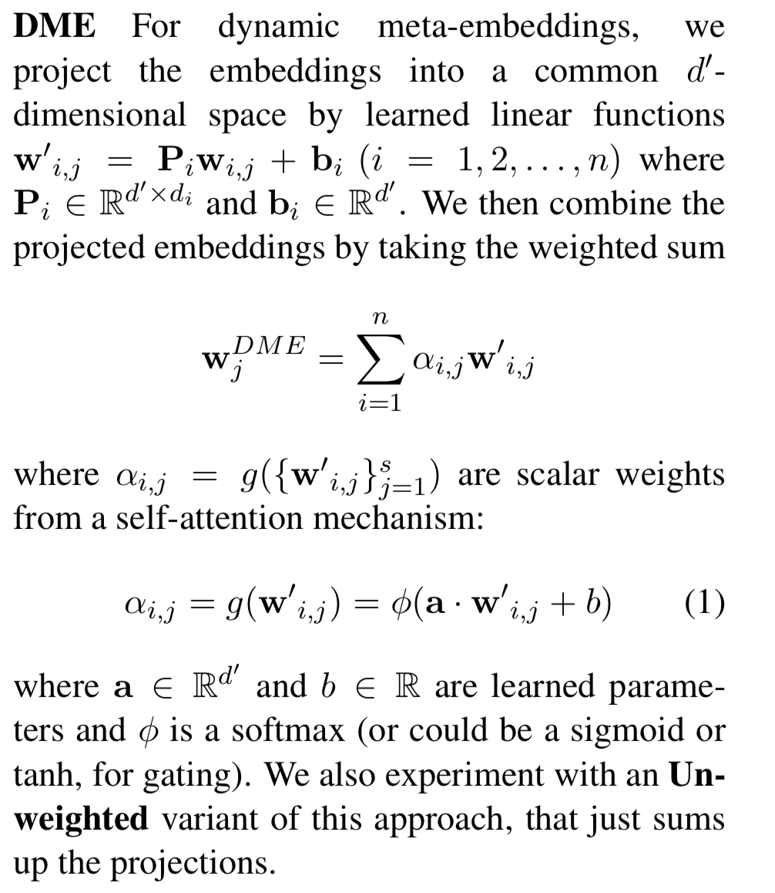
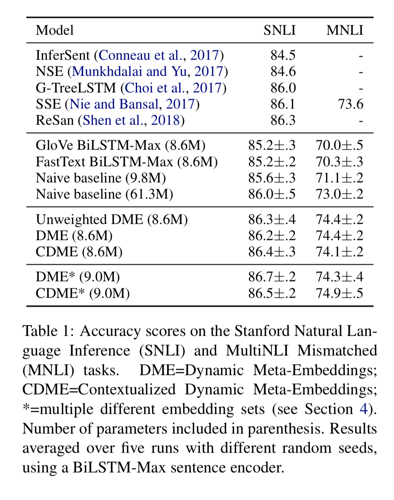
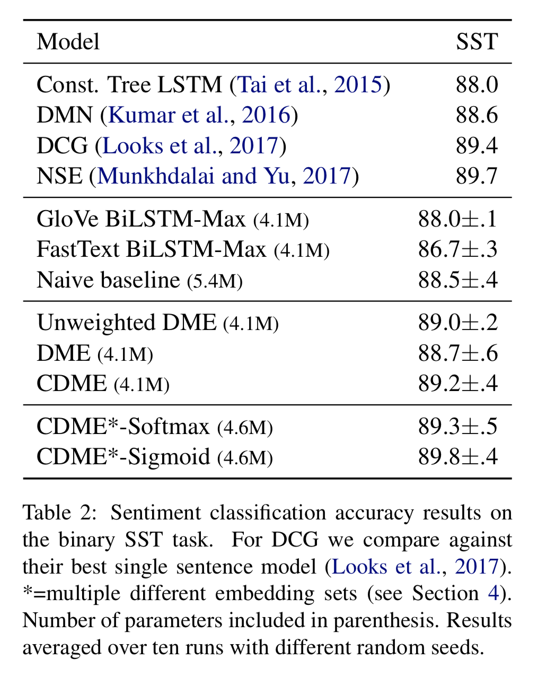

- https://arxiv.org/pdf/1804.07983.pdf

В статье описывается метод комбинирования разных векторных представлений для улучшения
оценки качества на целевой задаче.
Например, у нас есть Glove, Word2Vec, Fasttext представления или такие же представления,
но обученные на разных корпусах.

Как их можно скомбинировать?
1. 
	Конкатенация - в итоге получаем один большой вектор для слова.
2. 
	DME (dynamic meta-embedding) - проецируем эмбеддинги в общее пространство и вычисляем
	взвешенную сумму используя self-attention механизм.
	
3. 
	DME без взвешенной суммы - сумма проекций.
4. 
	Context-dependent DME - считаем итоговые эмбеддниги как DME, но еще используем контекст в предложении.

Методы 2-4 нужно использовать во время обучения на целевой задаче.

Результаты:

Как видим даже обычная конкатенация дает прирост качества.
Но с точки зрения памяти и количества параметров она неоптимальна, поэтому лучше использовать
другие методы.

