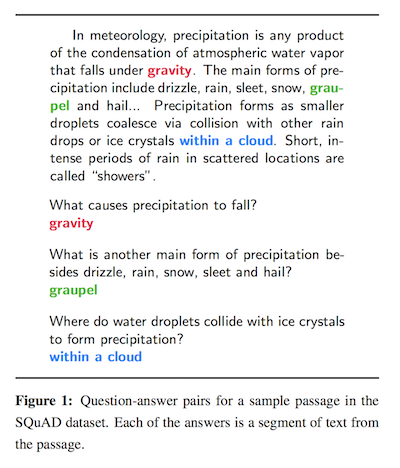
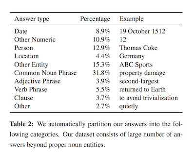
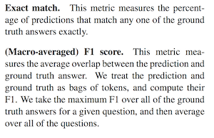

- Ссылка на статью: [arXiv](https://arxiv.org/abs/1606.05250)

# Ключевые моменты

- Датасет - это тройка вида (вопрос, ответ, пара абзацев где описывается ответ).

- 107,785 пар (вопрос, ответ).
- Лучшая F1 полученная в статье - 51%.
- F1 человека - 86.8%.
- Хорошо описан процесс сбора датасета через краудсорсинг.
- Категории ответов.

- Два типа оценки качества: F1 и Exact Match.

